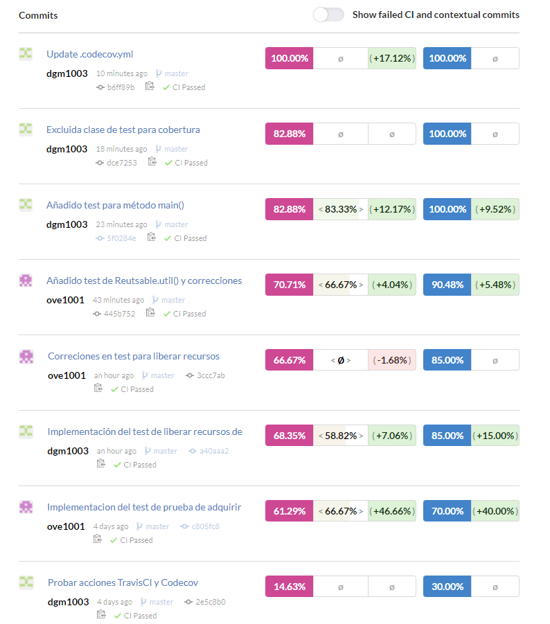
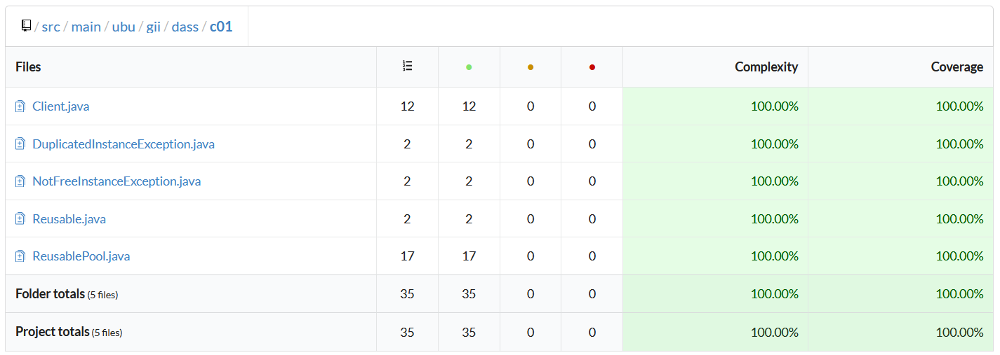
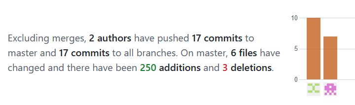

poolobject
==========

  

Java code example of creational design pattern pool object

Workshop to use good practices in software developmemnt: testing and measurement.

Authors:

- Carlos Lopez Nozal
- Jesus Alonso Abad

- Diego García Muñoz
- Óscar Valverde Escobar
 
# Índice
1. [Introducción](#intro)
2. [Objetivos](#objetivos)
3. [Enunciado](#enunciado)
4. [Solución](#solucion)
5. [Cuestiones](#cuestiones)
   1. [¿Se ha realizado trabajo en equipo?](#c1)
   2. [¿Tiene calidad el conjunto de pruebas disponibles?](#c2)
   3. [¿Cuál es el esfuerzo invertido en realizar la actividad?](#c3)
   4. [¿Cuál es el número de fallos encontrados en el código?](#c4)

---

## INTRODUCCIÓN 
Práctica centrada en la monitorización de un proceso de integración contínua para las pruebas de un código, para que se comprendan los conceptos de medición relacionados con las pruebas software.

## OBJETIVOS 
 - Comprender los objetivos de medición relacionados con la caracterización y la evaluación de productos, procesos y recursos software
 - Comprender, aplicar y analizar técnicas de medición sobre entidades de productos software relacionados con conjuntos de pruebas de software
 - Comprender, aplicar y analizar medidas relacionadas sobre entidades de proceso y recursos de prueba del software

## ENUNCIADO 
En la práctica se va simular un pequeño desarrollo de un producto software para realizar mediciones sobre él. El objetivo es establecer un caso de estudio que sirva para caracterizar y evaluar tanto el producto desarrollado como el proceso seguido.
#### (a) Descripción del producto
Dado un código de ejemplo del patrón diseño creacional Pool Object, se debe crear una batería de pruebas tal que las coberturas de sus clases sean del 100%. El código de las clases se puede obtener en el repositorio https://github.com/clopezno/poolobject. La batería de pruebas JUnit debe estar contenida en la clase ubu.gii.dass.test.c01.ReuseblePoolTest.java.
#### (b) Descripción del proceso
El proceso de desarrollo de la batería de pruebas se va a gestionar utilizando el control de versiones del sistema Git proporcionado por el repositorio de proyectos GitHub (https://github.com ). 
Los pasos para gestionar el procesos son los siguientes:
1. Cada miembro del equipo tiene que estar registrado en GitHub, Travis CI y Codecov.io.
2. Uno de los miembros tiene que realizar un fork del repositorio donde se encuentra el código que se quiere probar https://github.com/clopezno/poolobject. El nuevo repositorio tiene que ser público.
3. Invitar al resto de miembros del equipo para que puedan participar en el desarrollo de las pruebas.
4. Vincular el proyecto con Travis CI y Codecov.io.
5. Cada nuevo test realizado ejecutar un commit/push al repositorio del grupo. El texto del commit tiene que describir el caso de prueba añadido.
6. Verificar el resultado de las pruebas en el pipeline de integración continua y cómo la calidad del producto va mejorando con las sucesivas integraciones.

## SOLUCIÓN 
Se han realizado las pruebas en la clase _ubu.gii.dass.test.c01.ReuseblePoolTest.java_, completando los tres casos de prueba proporcionados, y añadiendo 4 nuevos casos de prueba para obtener una mayor cobertura de forma más organizada.
También hemos excluido los ficheros de la carpeta de test del análisis de cobertura en codecov, modificando el fichero _.codecov.yml_, pues no tendría sentido analizar su cobertura.

## CUESTIONES 
### ¿Se ha realizado trabajo en equipo? 
Sí, se puede ver como hemos realizado commits intercalados entre los colaboradores, a lo largo de varias sesiones en las que trabajábamos en conjunto, y en cada uno de esos commits trabajábamos en alguna parte en concreto ha ido aumentando la cobertura progresivamente. El informe/Readme lo hemos realizado también en conjunto, en un word, aunque luego solamente uno haya hecho commits del readme ajustando el formato.

  

https://github.com/dgm1003/poolobject/graphs/contributors

https://app.codecov.io/gh/dgm1003/poolobject/commits?page=1

### ¿Tiene calidad el conjunto de pruebas disponibles? 
Como se puede ver, se realiza una cobertura del 100% de las clases y métodos del proyecto (exceptuando la clase de test propia, lo cual sería imposible). Hemos diseñado los test para que se puedan realizar en cualquier orden deseado, y de modo que se capture un número elevado de posibles comportamientos. Las diferentes pruebas que realizamos son:
 - Comprobamos que al pedir instancias de un PoolObject siempre obtenemos el mismo objeto, y que dicho objeto no es null.
 -	Comprobamos que al obtener objetos de un PoolObject nuevo obtenemos un máximo de 2 objetos diferentes, y que al intentar obtener más el programa lanza la excepción correspondiente.
 -	Comprobamos que al devolver objetos al PoolObject solamente se podrá devolver cada objeto una vez, y si se intenta volver a meter sin haberlo sacado del pool, el programa lanza la excepción correspondiente.
 -	Comprobamos que el mensaje de los diferentes Reusables se genera correctamente.
 -	Comprobamos que al ejecutarse el método main(), el pool acaba vacío

También creamos dos casos de prueba que encontraron errores. Una vez detectados los errores, modificamos los casos de prueba para que pasasen como correctos cuando detectasen el error, pues en la práctica no teníamos que modificar los archivos originales, y de este modo conseguimos que nuestros commits pasen los checks de JavaCI y TravisCI, pues si no fuese el caso no se llegaría a comprobar la cobertura mediante codecov. Estos dos casos de prueba son los siguientes:  
 -	Comprobamos que, al crear un nuevo objeto de tipo Reusable inicializado como null, no se pueda introducir al pool mediante la función releaseReusable().
 -	Comprobamos que no sea posible introducir Reusables creados externamente, que hagan que el pool exceda el tamaño definido inicialmente (en este caso, 2).

Se puede ver el nivel de cobertura con más detalle en: https://app.codecov.io/gh/dgm1003/poolobject/

### ¿Cuál es el esfuerzo invertido en realizar la actividad? 
Para medir el esfuerzo nos hemos centrado en varias métricas:
 - Primero, hemos realizado **17 commits** entre ambos, los cuales han consistido de **250 adiciones y 3 borrados**, a lo largo de todos los ficheros del repositorio. 
 - Comparado con la versión que se nos ha proporcionado, hemos añadido al fichero _ReusablePoolTest.java_ un total de **180 líneas de código**.
 - Le hemos dedicado a esta práctica aproximadamente 8 horas de trabajo en conjunto, que al ser 2 colaboradores sería el equivalente a **16 horas** de trabajo total.

Todas estas medidas han sido tomadas teniendo en cuenta el estado del repositorio en el commit anterior a terminar este archivo README.md.

Se pueden ver varias medidas del trabajo realizado en: https://github.com/dgm1003/poolobject/pulse

### ¿Cuál es el número de fallos encontrados en el código? 
Hemos encontrado varios fallos en el código, los cuales se han probado mediante dos nuevos test. Uno comprueba que es posible devolver recursos nulos al pool, los cuales originarán un NullPointerException al intentar utilizarlos posteriormente. El otro problema detectado es que se pueden devolver recursos al pool generados externamente, por lo que se podrían agregrar recursos no instanciados en su origen o descendientes de dichos recursos que modifiquen su comportamiento original. Además, se pueden devolver tantos recursos distintos como se quiera, por lo que se puede hacer crecer incrotroladamente el pool hasta saturar la memoria.
